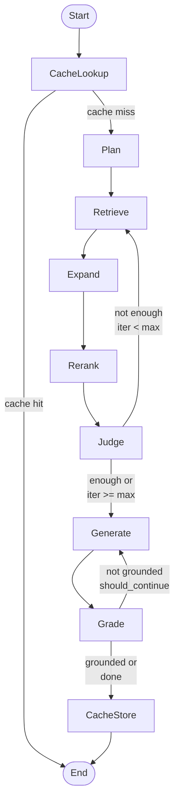

# Query Flow 보고서

## 목차
1. [개요](#개요)
2. [시스템 아키텍처](#시스템-아키텍처)
3. [State 정의](#state-정의)
4. [노드 구성 및 역할](#노드-구성-및-역할)
5. [워크플로우 흐름](#워크플로우-흐름)
6. [분기 로직](#분기-로직)
7. [반복 처리 메커니즘](#반복-처리-메커니즘)

---

## 개요

Query Flow는 **LangGraph StateGraph** 기반의 RAG(Retrieval-Augmented Generation) 질의 처리 워크플로우입니다. 사용자 질문을 받아 문서를 검색하고, 충분성을 판단하며, 환각(hallucination)을 검사하여 최종 답변을 생성합니다.

### 주요 특징
- **Adaptive Retrieval**: 충분성 판단 후 필요시 재검색
- **LLM-based Reranking**: 검색 결과를 LLM으로 재순위화
- **Hallucination Detection**: 답변의 근거성 검증
- **Semantic Cache**: 유사 질문 재사용으로 성능 향상
- **Query Planning**: 복잡한 질문을 구조화된 플랜으로 변환

---

## 시스템 아키텍처

```
┌─────────────┐
│ User Query  │
└──────┬──────┘
       │
       ▼
┌─────────────────────────────────────────────────────────┐
│                  Query Flow Graph                       │
│                                                          │
│  CacheLookup → Plan → Retrieve → Expand → Rerank       │
│                          ↑          ↓                   │
│                          └──────  Judge                 │
│                                     ↓                   │
│                                 Generate                │
│                                     ↓                   │
│                                   Grade ──┐             │
│                                     ↓     │ (rewrite)   │
│                                CacheStore │             │
│                                     ↓     ↓             │
│                                    END                  │
└─────────────────────────────────────────────────────────┘
```

---

## State 정의

`RAGState` (TypedDict)는 워크플로우 전체에서 공유되는 상태를 정의합니다.

### 상태 구조

```python
class RAGState(TypedDict, total=False):
    # === Input ===
    query: str                              # 사용자 질문
    
    # === Query Planning ===
    query_plan: Optional[QueryPlan]         # 구조화된 쿼리 플랜
    current_subquery: Optional[str]         # 현재 처리 중인 서브쿼리
    subquery_index: int                     # 서브쿼리 인덱스
    
    # === Retrieval ===
    candidates: List[RetrievedChunk]        # 현재 검색 결과
    pool_high: List[RetrievedChunk]         # 고득점 청크 (rerank 후)
    pool_all: List[RetrievedChunk]          # 전체 검색 결과 누적
    
    # === Loop Control ===
    iteration: int                          # 현재 반복 횟수
    max_iters: int                          # 최대 반복 횟수
    missing_aspects: List[str]              # 부족한 측면들
    
    # === Sufficiency ===
    sufficiency: Optional[SufficiencyResult] # 충분성 판단 결과
    
    # === Answer ===
    answer: Optional[str]                   # 최종 답변
    evidence: List[Dict[str, Any]]          # 답변 근거 문서
    
    # === Hallucination ===
    hallucination: Optional[HallucinationResult]  # 환각 검사 결과
    
    # === Cache ===
    cache_hit: bool                         # 캐시 히트 여부
    cached_answer: Optional[str]            # 캐시된 답변
    
    # === Flow Control ===
    should_continue: bool                   # 반복 계속 여부
    error: Optional[str]                    # 에러 메시지
    
    # === Logging ===
    flow_log: List[str]                     # 노드 흐름 기록
```

### 주요 데이터 구조

#### RetrievedChunk
```python
class RetrievedChunk(TypedDict):
    chunk_id: str                   # 청크 고유 ID
    doc_id: str                     # 문서 ID
    text: str                       # 청크 텍스트
    score: float                    # 검색 점수
    weighted_score: float           # 가중 점수
    metadata: Dict[str, Any]        # 메타데이터 (filename, page 등)
```

---

## 노드 구성 및 역할

### 1. **CacheLookup** (cache_lookup)
**파일**: `graph/cache/lookup.py`

**역할**: Semantic Cache에서 유사 질문의 답변 검색

**동작**:
- 설정(`CACHE_ENABLED`)이 활성화된 경우에만 동작
- 과거 질문과 유사도 비교 (threshold 기반)
- 캐시 히트 시 즉시 종료, 미스 시 다음 단계 진행

**출력**:
- `cache_hit`: True/False
- `cached_answer`: 캐시된 답변 (히트 시)

**현재 상태**: Placeholder 구현 (항상 cache miss)

---

### 2. **Plan** (plan_query)
**파일**: `graph/query/planner.py`

**역할**: 사용자 질문을 구조화된 QueryPlan으로 변환

**동작**:
- LLM을 사용하여 질문 분석
- JSON 스키마로 파싱하여 QueryPlan 생성
- intent, answer_style, constraints, subqueries 등 결정

**출력**:
- `query_plan`: QueryPlan 객체
  - `normalized_query`: 정규화된 질문
  - `intent_hint`: "explain", "howto", "troubleshoot" 등
  - `answer_style`: "short", "normal", "detailed"
  - `constraints`: ["korean", "cite_pages"] 등
  - `rewrites`: 대체 표현들
  - `subqueries`: 서브 질문들
- `max_iters`: 최대 반복 횟수 (기본 3)
- `iteration`: 0으로 초기화

**실패 처리**: 에러 시 기본 QueryPlan 생성 (fallback)

---

### 3. **Retrieve** (retrieve_chunks)
**파일**: `graph/query/retriever.py`

**역할**: Chroma vector DB에서 ANN 검색 수행

**동작**:
1. 검색 쿼리 결정:
   - subquery 모드: `query_plan.subqueries[idx]` 사용
   - 일반 모드: `query_plan.normalized_query` 사용
   - 반복 시: `missing_aspects`를 쿼리에 추가
   
2. Chroma에서 유사도 검색 (`RETRIEVAL_TOP_K`개)

3. 결과를 `RetrievedChunk`로 변환

4. 중복 제거 후 `pool_all`에 누적

**출력**:
- `candidates`: 현재 검색 결과
- `pool_all`: 전체 누적 결과 (중복 제거)

**주요 로직**:
```python
# chunk_id 기반 중복 제거
seen_ids = {c["chunk_id"] for c in pool_all}
for c in candidates:
    if c["chunk_id"] not in seen_ids:
        pool_all.append(c)
```

---

### 4. **Expand** (expand_neighbors)
**파일**: `graph/query/expander.py`

**역할**: 검색된 청크의 이웃 청크 확장

**동작**:
- 검색된 청크의 (doc_id, page) 정보 수집
- 같은 문서 내 page ±1 청크 확장 대상 생성
- 이미 존재하는 청크 제외

**출력**: 
- 현재는 placeholder 구현
- 실제 구현 시 Chroma metadata filter로 이웃 검색

**목적**: 
- 문맥 연속성 확보
- 페이지 경계로 나뉜 정보 연결

---

### 5. **Rerank** (rerank_chunks)
**파일**: `graph/query/reranker.py`

**역할**: LLM 기반 재순위화로 고품질 청크 선택

**동작**:
1. `pool_all`에서 최대 10개 청크 준비
2. LLM에 쿼리와 청크 목록 제공
3. 관련성 순위 판단 (인덱스 배열 반환)
4. 상위 `RERANK_TOP_K`개를 `pool_high`에 저장

**출력**:
- `pool_high`: 재순위화된 상위 청크

**프롬프트 예시**:
```
Query: Transformer self-attention

Chunks:
[0] attention mechanism calculates...
[1] neural network architecture...
[2] self-attention allows model to...

Output the indices: [2, 0, 1]
```

---

### 6. **Judge** (judge_sufficiency)
**파일**: `graph/query/sufficiency.py`

**역할**: 검색된 컨텍스트가 답변하기에 충분한지 판단

**동작**:
1. `pool_high`의 청크들을 컨텍스트로 구성
2. LLM에 충분성 판단 요청
3. `SufficiencyResult` 생성:
   - `score`: 0.0-1.0 충분도 점수
   - `verdict`: "enough" or "not_enough"
   - `missing_aspects`: 부족한 정보 목록

**출력**:
- `sufficiency`: SufficiencyResult
- `missing_aspects`: 부족한 측면들
- `should_continue`: score < MIN_SUFFICIENCY && iteration < max_iters
- `iteration`: iteration + 1

**반복 결정 로직**:
```python
should_continue = (
    result.score < MIN_SUFFICIENCY and 
    next_iter < max_iters
)
```

---

### 7. **Generate** (generate_answer)
**파일**: `graph/query/generator.py`

**역할**: 최종 답변 생성

**동작**:
1. `pool_high`에서 컨텍스트 구성
2. 각 청크에 출처 레이블 추가: `[파일명 p.페이지]`
3. LLM에 답변 생성 요청
4. Evidence 메타데이터 수집

**출력**:
- `answer`: 최종 답변 (인라인 인용 포함)
- `evidence`: 사용된 문서 정보 목록

**프롬프트 규칙**:
- 한국어 답변
- 인라인 인용: `"...내용... [파일명 p.페이지]"`
- 불확실 시 명시
- 포괄적이지만 간결하게

---

### 8. **Grade** (grade_hallucination)
**파일**: `graph/grader/hallucination.py`

**역할**: 생성된 답변의 근거성(groundedness) 검증

**동작**:
1. 답변과 컨텍스트 비교
2. LLM으로 환각 검사
3. `HallucinationResult` 생성:
   - `grounded`: True/False
   - `score`: 0.0-1.0 근거도 점수
   - `reason`: 설명

**출력**:
- `hallucination`: HallucinationResult
- `should_continue`: grounded=False인 경우 재생성

**분기**:
- `grounded=True`: 캐시 저장 후 종료
- `grounded=False && should_continue`: Generate로 재생성
- `grounded=False && !should_continue`: 그대로 종료

---

### 9. **CacheStore** (cache_store)
**파일**: `graph/cache/store.py`

**역할**: 성공적인 답변을 캐시에 저장

**동작**:
- `query_plan.query_id`로 `CacheRecord` 생성
- Metadata store에 저장 (TODO: embedding도 저장)

**출력**: 없음 (종료 직전 노드)

**현재 상태**: Metadata store만 업데이트

---

## 워크플로우 흐름

### 전체 흐름도



### 단계별 데이터 흐름

#### Phase 1: Cache & Planning
```
User Query
    ↓
[CacheLookup] → cache_hit? → YES → END (cached_answer)
    ↓ NO
[Plan] → query_plan (normalized_query, intent, subqueries)
```

#### Phase 2: Retrieval Loop
```
[Retrieve] → candidates (top-k chunks)
    ↓
[Expand] → candidates + neighbors (placeholder)
    ↓
[Rerank] → pool_high (LLM-based top chunks)
    ↓
[Judge] → sufficiency.score
    ↓
    ├─ score < threshold & iter < max → LOOP to Retrieve
    │                                     (with missing_aspects)
    └─ score >= threshold or iter >= max → CONTINUE
```

#### Phase 3: Answer Generation & Validation
```
[Generate] → answer + evidence
    ↓
[Grade] → hallucination.grounded
    ↓
    ├─ grounded = False & should_continue → LOOP to Generate
    └─ grounded = True or done → CONTINUE
        ↓
    [CacheStore] → save to cache
        ↓
    END
```

---

## 분기 로직

### 1. check_cache_hit
```python
def check_cache_hit(state: RAGState) -> Literal["cache_hit", "plan"]:
    if state.get("cache_hit"):
        return "cache_hit"  # → END
    return "plan"           # → Plan Node
```

**조건**: `cache_hit` 플래그

**분기**:
- `cache_hit=True`: 즉시 종료 (cached_answer 반환)
- `cache_hit=False`: 정상 흐름 진행

---

### 2. should_loop
```python
def should_loop(state: RAGState) -> Literal["loop", "generate"]:
    if state.get("should_continue"):
        return "loop"       # → Retrieve Node (재검색)
    return "generate"       # → Generate Node
```

**조건**: Judge 노드에서 설정한 `should_continue`

**반복 조건**:
```python
should_continue = (
    sufficiency.score < MIN_SUFFICIENCY and
    iteration + 1 < max_iters
)
```

**분기**:
- `should_continue=True`: Retrieve로 돌아가 재검색
  - `missing_aspects`를 쿼리에 추가
  - `iteration` 증가
- `should_continue=False`: Generate로 진행

---

### 3. handle_hallucination
```python
def handle_hallucination(state: RAGState) -> Literal["rewrite", "done"]:
    hallu = state.get("hallucination")
    if hallu and not hallu.grounded and state.get("should_continue"):
        return "rewrite"    # → Generate Node (재생성)
    return "done"           # → CacheStore Node
```

**조건**: `hallucination.grounded` && `should_continue`

**분기**:
- `grounded=False && should_continue=True`: Generate로 돌아가 재생성
- `grounded=True` 또는 `should_continue=False`: CacheStore로 진행

---

## 반복 처리 메커니즘

### Retrieval Loop (검색 반복)

**트리거**: Judge 노드의 충분성 판단

**반복 조건**:
```python
sufficiency.score < MIN_SUFFICIENCY  # 예: 0.7
iteration < max_iters                 # 예: 3
```

**반복 시 변경사항**:
1. `iteration` 증가
2. `missing_aspects`를 쿼리에 추가
3. Retrieve → Expand → Rerank → Judge 재실행

**예시**:
```
Iteration 0:
  Query: "Transformer 구조"
  Retrieved: 5 chunks
  Sufficiency: 0.4 (not enough) → missing: ["self-attention", "positional encoding"]

Iteration 1:
  Query: "Transformer 구조 self-attention positional encoding"
  Retrieved: 7 chunks (누적 12 chunks in pool_all)
  Sufficiency: 0.8 (enough) → Generate
```

---

### Generation Loop (생성 반복)

**트리거**: Grade 노드의 환각 검사

**반복 조건**:
```python
hallucination.grounded == False
should_continue == True
```

**반복 시 변경사항**:
- Generate 노드 재실행 (동일 컨텍스트)
- TODO: 실제로는 프롬프트 수정 또는 temperature 조정

**현재 구현**: 
- `should_continue`는 설정에 따라 결정 (`HALLUCINATION_ON_FAIL`)
- 무한 루프 방지 필요

---

## 설정 파라미터

### settings.py에서 제어 가능

| 파라미터 | 기본값 | 설명 |
|---------|--------|------|
| `CACHE_ENABLED` | False | 캐시 활성화 여부 |
| `CACHE_THRESHOLD` | 0.9 | 캐시 히트 임계값 |
| `RETRIEVAL_TOP_K` | 10 | 검색 청크 수 |
| `RERANK_TOP_K` | 5 | 재순위 후 유지 청크 수 |
| `MIN_SUFFICIENCY` | 0.7 | 충분성 최소 점수 |
| `MAX_ITERATIONS` | 3 | 최대 반복 횟수 |
| `HALLUCINATION_CHECK_ENABLED` | True | 환각 검사 활성화 |
| `HALLUCINATION_ON_FAIL` | "warn" | 환각 감지 시 동작 |

---

## 그래프 빌드 코드

```python
def build_query_graph() -> StateGraph:
    builder = StateGraph(RAGState)
    
    # === Nodes ===
    builder.add_node("cache_lookup", cache_lookup)
    builder.add_node("plan", plan_query)
    builder.add_node("retrieve", retrieve_chunks)
    builder.add_node("expand", expand_neighbors)
    builder.add_node("rerank", rerank_chunks)
    builder.add_node("judge", judge_sufficiency)
    builder.add_node("generate", generate_answer)
    builder.add_node("grade", grade_hallucination)
    builder.add_node("cache_store", cache_store)
    
    # === Edges ===
    builder.set_entry_point("cache_lookup")
    
    builder.add_conditional_edges(
        "cache_lookup", check_cache_hit,
        {"cache_hit": END, "plan": "plan"}
    )
    
    builder.add_edge("plan", "retrieve")
    builder.add_edge("retrieve", "expand")
    builder.add_edge("expand", "rerank")
    builder.add_edge("rerank", "judge")
    
    builder.add_conditional_edges(
        "judge", should_loop,
        {"loop": "retrieve", "generate": "generate"}
    )
    
    builder.add_edge("generate", "grade")
    
    builder.add_conditional_edges(
        "grade", handle_hallucination,
        {"rewrite": "generate", "done": "cache_store"}
    )
    
    builder.add_edge("cache_store", END)
    
    return builder.compile()
```

---

## Public API

### run_query (동기 실행)
```python
def run_query(query: str) -> Dict[str, Any]:
    """
    Returns:
        {
            "answer": str,
            "evidence": List[Dict],
            "flow_log": List[str],
            "query_plan": QueryPlan,
            "sufficiency": SufficiencyResult,
            "hallucination": HallucinationResult,
            ...
        }
    """
```

### stream_query (스트리밍)
```python
def stream_query(query: str) -> Generator[str, None, None]:
    """
    현재: 전체 실행 후 청크 단위 반환 (시뮬레이션)
    TODO: 실제 스트리밍 구현
    """
```

---

## 실행 예시

### 성공적인 실행 (1회 반복)
```
Flow Log:
[CacheLookup] miss
[Planner] intent=explain
[Retriever] iter=0, found=10
[Expander] targets=8 (placeholder)
[Reranker] using all 10 chunks
[Sufficiency] score=0.85, iter=1/3
[Generator] answer_len=342
[HalluGrader] grounded=True
[CacheStore] saved
```

### 반복이 필요한 경우
```
Flow Log:
[CacheLookup] miss
[Planner] intent=troubleshoot
[Retriever] iter=0, found=5
[Expander] targets=4 (placeholder)
[Reranker] reranked to 5
[Sufficiency] score=0.45, iter=1/3  ← not enough
[Retriever] iter=1, found=7          ← re-retrieve with missing_aspects
[Expander] targets=6 (placeholder)
[Reranker] reranked to 5
[Sufficiency] score=0.78, iter=2/3  ← enough
[Generator] answer_len=428
[HalluGrader] grounded=True
[CacheStore] saved
```

---

## TODO 및 개선 사항

### 미구현 기능
1. **CacheLookup**: 실제 semantic cache 검색
2. **Expand**: Chroma metadata filter 기반 이웃 검색
3. **Stream**: 실제 streaming 생성 (현재는 시뮬레이션)
4. **HalluGrader**: LangSmith Hub 프롬프트 사용

### 최적화 포인트
1. **Parallel Subquery**: subquery들을 병렬로 검색
2. **Incremental Rerank**: pool_all 전체를 매번 rerank하지 않고 증분 처리
3. **Early Stopping**: 충분성이 매우 높으면 반복 조기 종료
4. **Dynamic TOP_K**: 쿼리 복잡도에 따라 검색 수 조정

### 견고성 개선
1. **Error Recovery**: 각 노드 실패 시 fallback 전략
2. **Timeout**: 무한 루프 방지 타임아웃
3. **Monitoring**: 각 노드 실행 시간/성능 추적
4. **Circuit Breaker**: 반복적 실패 시 중단

---

## 결론

Query Flow는 **Adaptive RAG** 패턴을 구현한 정교한 워크플로우입니다:

1. **캐시 레이어**로 불필요한 계산 회피
2. **Query Planning**으로 의도 파악 및 쿼리 최적화
3. **Retrieval Loop**로 충분한 정보 수집
4. **LLM Reranking**으로 품질 향상
5. **Hallucination Checking**으로 신뢰성 확보

각 노드는 독립적으로 개선 가능하며, LangGraph의 StateGraph 구조 덕분에 유연한 확장이 가능합니다.
